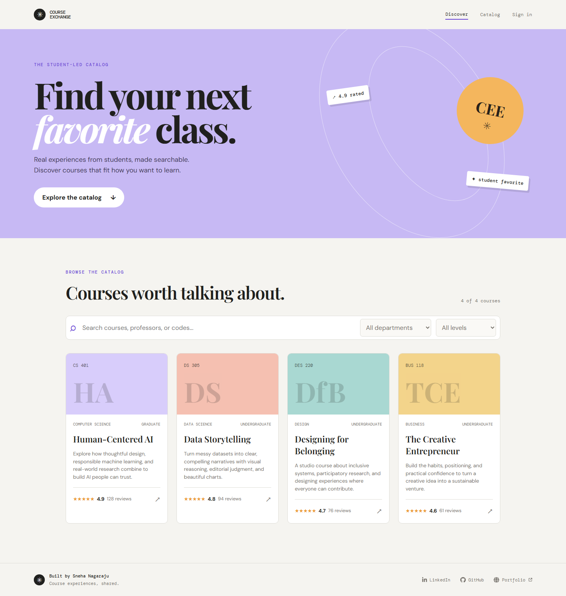
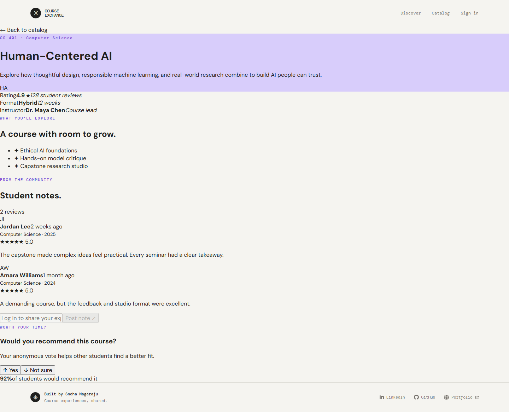
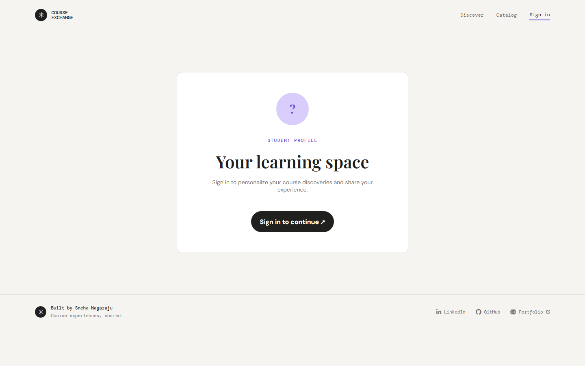

<p align="center">
  
</p>

<p align="center">
  <strong>A polished, student-led course discovery experience.</strong><br />
  Search classes, compare what matters, and learn from the people who took them.
</p>

<p align="center">
  <a href="https://github.com/snna2069/course-experience-exchange">Repository</a> ·
  <a href="https://snehaa.me/">Portfolio</a> ·
  <a href="https://www.linkedin.com/in/snehan-raju/">LinkedIn</a>
</p>

## The idea

Choosing a course should feel less like decoding a catalog and more like getting advice from a thoughtful classmate. **Course Experience Exchange (CEE)** turns student feedback into a friendly, searchable visual catalog.

The current showcase runs on curated local sample data, so the complete experience is available without MongoDB or a backend running.

## Showcase

<table>
  <tr>
    <td align="center" width="50%">
      <br />
      <sub>Discover the catalog</sub>
    </td>
    <td align="center" width="50%">
      <br />
      <sub>Read the details</sub>
    </td>
  </tr>
  <tr>
    <td align="center" colspan="2">
      <br />
      <sub>Personal profile</sub>
    </td>
  </tr>
</table>

## Features

- **Browse and search** courses by name, code, professor, department, or level.
- **Course cards** with ratings, review counts, format, and visual category treatments.
- **Course details** with instructor information, highlights, ratings, and student notes.
- **Interactive recommendations** with local yes / not-sure voting.
- **Showcase comments** that update instantly in the browser.
- **Responsive experience** designed for desktop, tablet, and mobile.
- **Profile and auth screens** that demonstrate the complete navigation flow.
- **Accessible UI details** including labels, focus states, landmarks, external-link safety, and rating announcements.

## Tech stack

### Active showcase

- React 19
- React Router
- Create React App / `react-scripts`
- CSS with responsive media queries
- Font Awesome icons
- Centralized local data in `frontend/course-feedback/src/data/courses.js`

### Preserved application path

The repository also retains the previously stabilized API path for future integration:

```text
React frontend → Express REST API → MongoDB
```

PostgreSQL, Kafka, and earlier infrastructure are preserved as inactive/legacy code and are not required for the showcase.

## Run locally

### Requirements

- Node.js 18+
- npm

### Start the showcase

```bash
git clone https://github.com/snna2069/course-experience-exchange.git
cd course-experience-exchange/frontend/course-feedback
npm install
npm start
```

Open [http://localhost:3000](http://localhost:3000).

### Create a production build

```bash
cd frontend/course-feedback
npm run build
```

The backend requires a running MongoDB instance:

```bash
cd backend
npm install
# Copy .env.example to .env and configure MONGODB_URI and JWT_SECRET
npm start
```

The API starts at [http://localhost:5000](http://localhost:5000).

## Project map

```text
frontend/course-feedback/
├── src/
│   ├── components/       Shared header, footer, auth, profile, and detail views
│   ├── data/courses.js   Central showcase content
│   ├── App.js            Routes, catalog search, and filters
│   └── global.css        Design tokens, typography, and accessibility
└── package.json
```

## Design direction

CEE uses an editorial visual language: warm paper tones, expressive serif headlines, mono metadata, soft color blocks, and restrained motion. The goal is to make academic discovery feel personal, calm, and memorable.

## Built by

**Sneha Nagaraju**

- [LinkedIn](https://www.linkedin.com/in/snehan-raju/)
- [GitHub](https://github.com/snna2069)
- [Portfolio](https://snehaa.me/)
